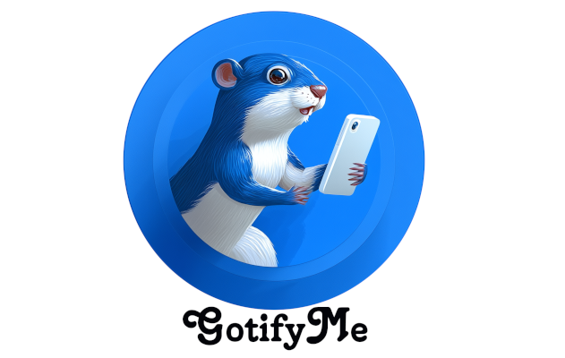

# GotifyMe

A Notification app leveraging [Gotify](https://github.com/gotify/server).  Implemented as a containerized Python [FastAPI](https://fastapi.tiangolo.com/) application that exposes a web interface to send notifications to a Gotify server, it can take a password for minimal authorization.

Honestly, this is a bit of a one-trick pony to start.  I found that I really liked [Gotify](https://github.com/gotify/server) and because it has a nice [REST interface](https://gotify.net/api-docs), plenty of apps out there integrate with it.  I debated just building apps that would engage with my own Gotify instance over REST, but then I would need to add new app identities and app keys all over for these basic push-notification apps.  

By having this intermediary, I can expose my private Gotify instance with a single app and key that the rest of my systems can use.  Perhaps in the end it won't be that useful, but it's a pretty good base to take and tweak for other uses.

## Key Features:
* Authentication: The app attempts to authenticate to the Gotify server using the provided "password" as a Client Token first (which was the case here). If that fails, it falls back to Basic Auth using the username and password.
* Token Management: It automatically finds or creates an Application named "FastAPI_Notify_App" to obtain an App Token for sending messages.
* Web Interface: A simple HTML form at the root URL (/) allows users to send custom notifications.
* Startup Test: The app sends a "Hello World" notification immediately upon startup to verify connectivity.
* REST API endpoint in Swagger (OpenAPI) at /docs
* FastAPI endpoint at /redoc

## Key Files:
* app/main.py: The FastAPI application entry point.
* app/gotify_client.py: Logic for Gotify API interaction (Auth & Messaging).
* app/static/index.html: The frontend user interface.
* Dockerfile: For containerization (runs on port 80).
* requirements.txt: Python dependencies.

## Key Folders:
* tests - for pytest tests
* charts - for Helm Charts

# Usage 

To build and run with Docker:

```
$ docker build -t notify-app .
$ docker run -p 8080:80 \
    -e GOTIFY_ENDPOINT="https://gotify.tpk.pw" \
    -e GOTIFY_USERNAME="myappname" \
    -e GOTIFY_PASSWORD="xxxx.xxxxxx" \
    -e NOTIFYPASS="mypassword"
    notify-app
```

*(Access at http://localhost:8080)*


To run dev mode locally:

```
$ python3 -m venv venv
$ source venv/bin/activate
(venv) $ pip install -r requirements.txt
(venv) $ uvicorn app.main:app --host 0.0.0.0 --port 8000
```

*(Access at http://localhost:8000)*

## Kubernetes

There is a reasonable set of default values in charts/gotifyme/values.yaml.

Note: there does exist a publicly accessable image you may use at harbor.freshbrewed.science/library/notifyapp:0.2, but, of course, you are welcome to change that repository and tag to your own.

### Installing with defaults:

```
$ helm install gotifyme ./charts/gotifyme
```

### Installing in namespace with your own values file

```
$ helm install gotifyme -f ./myvalues.yaml -n mynamespace ./charts/gotifyme
```

## Gotify on Devices

You can get [Gotify on Android via Play store](https://play.google.com/store/apps/details?id=com.github.gotify) or [F-Droid](https://f-droid.org/de/packages/com.github.gotify/).


I have heard those with iOS might be sorted with [iGotify Assistant](https://github.com/androidseb25/iGotify-Notification-Assistent) but as I have no Apple hardware (that runs Apple OSes), I can't test myself.

# Author

Gemini CLI with help from me, isaac.
- blog: https://freshbrewed.science/
- LI: https://www.linkedin.com/in/isaacinmn/
- GH: https://github.com/idjohnson/
- mastodon: https://noc.social/@Ijohnson
- email: isaac at freshbrewed dot science

